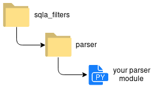

=====================
sqla-filters: Plugins
=====================

.. _sqla-filters-plugins-cyopp:

Create your own plugin parser
-----------------------------

You can of course create your own parser. Because you probably use a format
that's specific to your usage you can create a parser to manage this new format.

Two posibilities are offered to you:

1. **Namespace package**

2. **Standalone package**

Namespace package
^^^^^^^^^^^^^^^^^

.. _packaging-namespace-packages: https://packaging.python.org/guides/packaging-namespace-packages/
.. _pep420: https://www.python.org/dev/peps/pep-0420/

You can create a namespace package that injects the package code into the
namespace "sqla_filter.parser ". This makes it possible to have a better logic
in the e.g.

.. code-block:: python

    from sqla_filter.parser.<your module>import <your parser>

The creation of namespace package is as easy as a standalone package. You just
need to respect some conventions.

You must to have the folowing directory structure:

If you want more information about the namespace packages you can read the
documentation `packaging-namespace-packages`_.

You can also get more informations in the `pep420`_ that's the chosen method
for the sqla-filters project.

Standalone package
^^^^^^^^^^^^^^^^^^

You can create a "standalone " package as you normally do. The only thing that
change compared to the namespace package will be the include.
