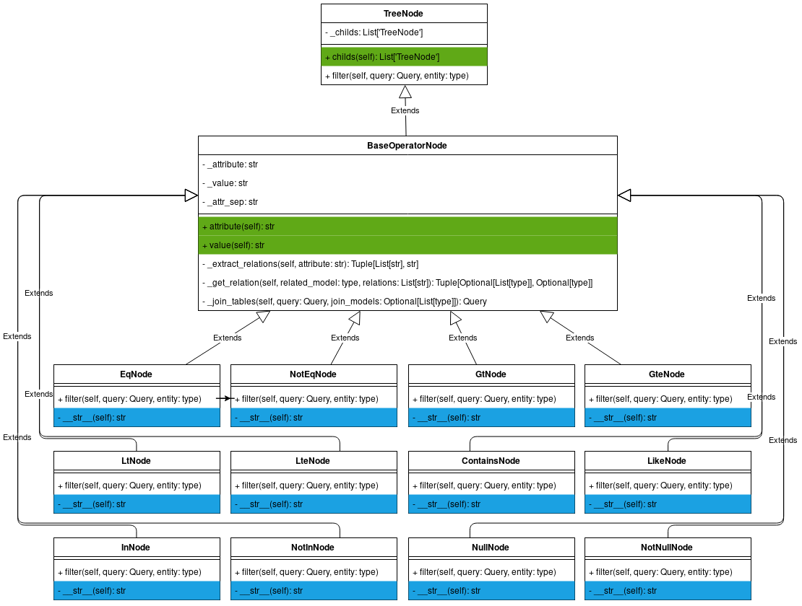

===================
sqla-filters: Nodes
===================

Base nodes
----------

Tree
^^^^

.. autoclass:: sqla_filters.nodes.base.TreeNode
    :private-members:
    :members:

Base logical
^^^^^^^^^^^^

.. autoclass:: sqla_filters.nodes.base.BaseLogicalNode
    :private-members:
    :members:

Base operational
^^^^^^^^^^^^^^^^

.. autoclass:: sqla_filters.nodes.base.BaseOperationalNode
    :private-members:
    :members:

Logical nodes
-------------

And
^^^

.. autoclass:: sqla_filters.nodes.logical.AndNode

Or
^^

.. autoclass:: sqla_filters.nodes.logical.OrNode

Operational nodes
-----------------

Equality
^^^^^^^^

.. autoclass:: sqla_filters.nodes.operational.EqNode

.. autoclass:: sqla_filters.nodes.operational.NotEqNode

Greater / Greater equal
^^^^^^^^^^^^^^^^^^^^^^^

.. autoclass:: sqla_filters.nodes.operational.GtNode

.. autoclass:: sqla_filters.nodes.operational.GteNode

Lower / Lower equal
^^^^^^^^^^^^^^^^^^^

.. autoclass:: sqla_filters.nodes.operational.LtNode

.. autoclass:: sqla_filters.nodes.operational.LteNode

Contains
^^^^^^^^

.. autoclass:: sqla_filters.nodes.operational.ContainsNode

Like
^^^^

.. autoclass:: sqla_filters.nodes.operational.LikeNode

In
^^

.. autoclass:: sqla_filters.nodes.operational.InNode

.. autoclass:: sqla_filters.nodes.operational.NotInNode

Null
^^^^

.. autoclass:: sqla_filters.nodes.operational.InNode

.. autoclass:: sqla_filters.nodes.operational.NotInNode
