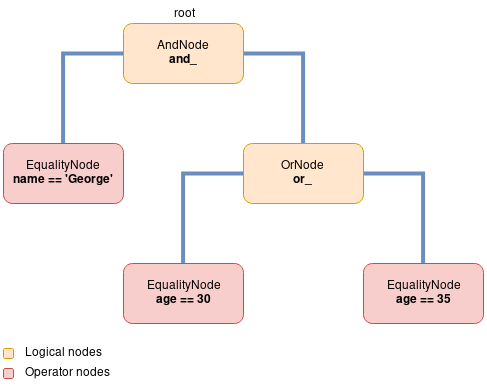

sqla-filters: Tree
==================

Once the parser parses the data that was given it creates a tree.
This tree is composed of the nodes found in the package ``sqla_filter.filter.nodes``.

The generated tree is of the following form:

The class that contains this tree is the next class:

.. autoclass:: sqla_filters.filter.SqlaFilterTree

.. note::
    This is from this class you can call the filter function.
